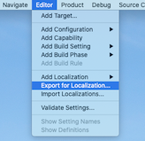

# xcloc-tools

[](https://opensource.org/licenses/MIT)

xcloc-tools is a Python command line tool that converts Xcloc files and Excel files to and from each other.
This tool allows you to localize iOS / Mac Apps messages using familiar Excel.

Xcloc is the new format for iOS /Mac app localization supported from Xcode 10.
You can see more detail from [WWDC 2018 session video](https://developer.apple.com/videos/play/wwdc2018/404/).

- [Features](#Features)
- [Getting Started](#getting-started)
    - [Requirements](#requirements)
    - [Installation](#installation)
- [Usage](#usage)
    - [Export Xcloc file](#export-xcloc-file)
    - [Convert xcloc to excel](#convert-xcloc-to-excel)
    - [Convert excel to xcloc](#convert-excel-to-xcloc)
    - [Add Screenshot to Excel](#add-screenshot-to-excel)
- [Author](#author)
- [License](#license)
- [Acknowledgments](#acknowledgments)

## Features
- [x] Convert Xcloc to Excel.
- [x] Convert Excel to Xcloc.

## Getting Started

### Requirements

* Python 3.8+
* Xcode 11.0+

### Installation

Download the code from this repo and install packages via pip.

```bash
pip install -r requirements.txt
```

## Usage

### Export Xcloc file

1. Open your iOS/Mac App project on Xcode.
1. Select your project root from project navigator.
2. Select Editor > Export Localization.. from Xcode menu.

   


### Convert Xcloc to Excel

Execute following command to convert Xcloc to Excel format.

```bash
python xcloc_tools/xcloc2excel.py <xcloc file>
```

e.g.
```bash
python xcloc_tools/xcloc2excel.py MyApp/en.xcloc
```


### Convert Excel to Xcloc

Execute following command to convert Excel to Xcloc file.

```bash
python xcloc_tools/excel2xcloc.py <excel file>
```

e.g.
```bash
python xcloc_tools/excel2xcloc.py en.xlsx
```

### Add Screenshot to Excel

If you place a png file with the same name as storyboard in the `Notes` directory in Xcloc, it will be added as a screenshot to Excel.

e.g.
```
en.xcloc
 - Localized Contents
 - Notes
   - Main.png
   - Tutorial.png
 - Source 
 - contents.json
```

## FAQ

### Can I convert any Excel file to an xcloc file?

No, only Excel files output by the tool are supported.

### Can the Excel file output by the tool be edited freely?

If you want to convert Excel file to Xcloc file again, please do not edit the followings:

- Sheet name
- Header text
- Cell value, excluding "Target"

## Author

Watanabe Toshinori – toshinori_watanabe@tiny.blue

## License

This project is licensed under the MIT License. See the [LICENSE](LICENSE) file for details.

## Acknowledgments

This tool uses the following code and packages:

* [openpyxl](https://openpyxl.readthedocs.io)
*  [python/cpython: bpo-14465](https://github.com/python/cpython/commit/b5d3ceea48c181b3e2c6c67424317afed606bd39)
